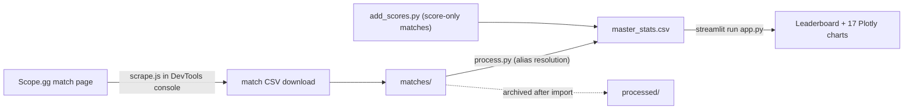

# cs-stats

**Scrape, consolidate, and visualise Counter-Strike 2 match stats for your friend group — from Scope.gg match pages to an interactive Streamlit leaderboard.**

cs-stats settles the eternal friend-group argument about who is actually the best player, with data instead of vibes. A paste-in browser script exports both teams' stat tables from a match page to CSV, a small Python pipeline merges every export into one master dataset (resolving everyone's rotating gamer tags and alt accounts to a single identity along the way), and a Streamlit dashboard turns it all into a sortable leaderboard and 17 charts. The repo ships with real sample data — 225 player-match rows across 20 matches — so the dashboard works out of the box.

<!-- screenshot: Streamlit dashboard showing the master analytics grid and the first pair of charts (Avg KAST % and Avg ADR with error bars) -->

## How it works



1. **Scrape** — open a finished match on Scope.gg, paste `scrape.js` into the browser DevTools console, and it downloads a CSV of both teams' per-player stats (K/D/A, damage, ADR, HLTV 2.1 rating, KAST %, opening and trade kills), with the match ID pulled from the URL and the score read from the page.
2. **Ingest** — drop the CSVs into `matches/` and run `python process.py`. For every player name it hasn't seen before, it asks who that actually is and remembers the answer in `aliases.json` — so smurf accounts and novelty Unicode nicknames all roll up to one person. Rows are appended to `master_stats.csv` and the source file is archived to `processed/`.
3. **Visualise** — `streamlit run app.py` renders a 29-column analytics grid plus 17 ranked bar charts.

Matches with no detailed stats (e.g. nobody remembered to record them) can still be logged with `python add_scores.py`, which captures teams, rosters, and the final score. They count toward win/loss records and round totals without polluting anyone's stat averages.

## Features

- **One-paste match export** — no browser extension, no backend: `scrape.js` walks the match page's paired team/stat tables and triggers a client-side CSV download.
- **Persistent identity resolution** — an interactive alias map (`aliases.json`) canonicalises volatile in-game names; at HEAD, 27 aliases map to 20 players.
- **Per-round normalisation** — kills, deaths, assists, opening kills, and trade kills are divided by rounds played (parsed from each match's score string), so players with different match counts compare fairly.
- **Consistency, not just averages** — charts show standard-deviation error bars, so a streaky 1.3-rating player looks different from a steady one.
- **Composite Overall Rank** — each player's position averaged across nine core metrics (KAST %, ADR, kills/round, opening kills/round, ADR differential, assists/round, trade kills/round, K/D, HLTV 2.1 rating).
- **Win/loss engine** — match results and round win rates are derived directly from score strings, from each team's own perspective.
- **Score-only match support** — quick CLI entry for matches without scraped stats, with the score automatically flipped for the opposing team's rows.

## Quick start

Requires Python 3 and pip.

```bash
git clone https://github.com/chrisJuresh/cs-stats.git
cd cs-stats
pip install -r requirements.txt
streamlit run app.py
```

The dashboard opens in your browser using the bundled `master_stats.csv`.

## Adding your own matches

**Full stats (from Scope.gg):**

1. Open the match details page and the stats tab you want to export.
2. Paste the contents of `scrape.js` into the DevTools console and press Enter. A file named `match_<id>_<tab>.csv` downloads.
3. Move the file(s) into `matches/` and run:

```bash
python process.py
```

You'll be prompted once per unknown player name; press Enter to keep the name or type the person's real handle. Imported files are moved to `processed/` so they are never double-counted.

**Score only:**

```bash
python add_scores.py
```

Prompts for both team names, the final score, and comma-separated rosters, then appends the rows to `master_stats.csv`.

## What the dashboard shows

- A master grid with 29 columns per player: matches, wins/losses/draws, win rate, round totals and round win rate, averages and totals for every combat stat, K/D ratio, HLTV 2.1 rating, and Overall Rank.
- 17 bar charts in priority order — from KAST % and ADR down to lifetime totals, matches played, and the overall ranking — each colour-scaled, sorted in the direction that makes sense for the metric, and annotated with exact values.

The key metrics, for the uninitiated:

| Metric | Meaning |
|---|---|
| KAST % | Share of rounds with a **K**ill, **A**ssist, **S**urvival, or **T**rade |
| ADR / ADR Diff | Average damage per round / net ADR advantage over opponents |
| HLTV Rating 2.1 | The standard composite performance rating |
| Open kills | First blood of the round |
| Trade kills | Avenging a teammate's death within the trade window |

## Project structure

```
app.py            Streamlit dashboard (aggregation, leaderboard, 17 charts)
scrape.js         Browser-console exporter for Scope.gg match pages
process.py        CSV ingestion + interactive player-alias resolution
add_scores.py     CLI for logging score-only matches
aliases.json      Persisted gamer-tag → player mapping
master_stats.csv  Master dataset (one row per player per match)
matches/          Drop new scraped CSVs here (created on first run)
processed/        Archive of already-imported match CSVs
```

## Tech stack

Python with **pandas** (aggregation), **Streamlit** (UI), and **Plotly Express** (charts); the scraper is dependency-free vanilla JavaScript.

## Limitations

- `scrape.js` targets Scope.gg's generated CSS class names, so a site redesign can break it — expect to update the selectors occasionally.
- `master_stats.csv` now carries a `Team Outcome` column that raw scrape exports don't have; rows appended by `process.py` need that column accounted for (the dashboard itself recomputes outcomes from scores, so it never reads the column).
- Dependencies in `requirements.txt` are unpinned.
- This is a personal project built for one friend group's data; there is no hosted deployment and no test suite.

## Status & credits

Built as a weekend-style personal project (June 2026) and functional for its purpose; not under active development. The composite ranking and matches-played charts were contributed by [@Jeromesds0](https://github.com/Jeromesds0) via pull requests.
